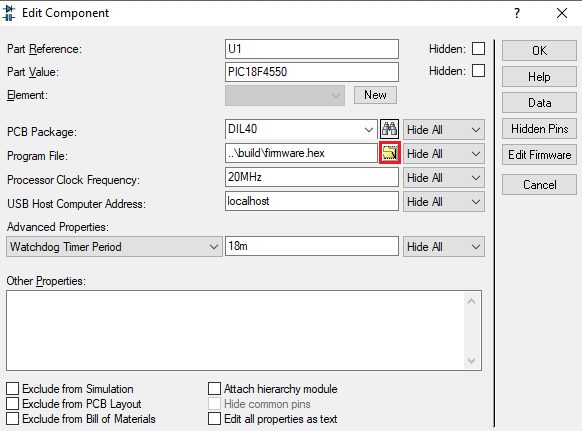
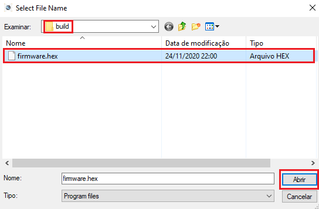
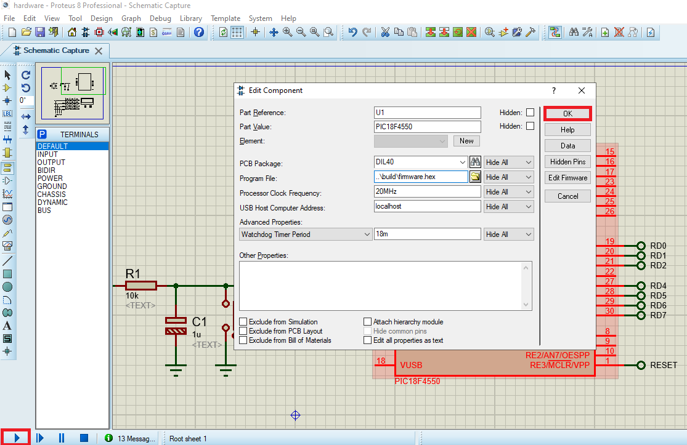

# Temperature Gauge

Firmware that simulates a temperatura gauge with the sensor LM35 using analog comparators and ADC

## Basic operation

- A temperature value is provided by the LM35, and using the PIC's ADC, the value read is shown on the 2 displays of 7 segments of the project (ten and unit)
- Values ​​above 99 ° C cannot be represented
- The system has 3 warning LEDs, which act as described:
  - Alert_1: activated when the temperature exceeds 80 ° C, activation is automatic, without explicit temperature reading
  - Alert_2: same molds as the previous one, but for a temperature above 90 ° C
  - Alert_3: should be flashing when the temperature is greater than or equal to 100 ° C.

## ☁️ Links

- [Specifications](docs/pdf/specifications.pdf)
- [Support Material](docs/pdf/support_material.pdf)

## 💻 Project

#### PICF184550


#### Hardware


#### Running Simulation


## 🚀 Technologies

 C ANSI

 Proteus

## 🏃 Usage

Before you compile the code you **have to install the [XC8 Compiler](http://www.microchip.com/mplabxc8windows)**, then just copy and paste one by one the commands bellow:

```
git clone https://github.com/douglasJovenil/temperature-gauge
cd temperature-gauge/src
xc8 -I../include -I../lib/ADC -I../lib/74HC164 ../lib/ADC/ADC_config.c ../lib/74HC164/74HC164.c main.c -Ofirmware --chip=18f4550 --outdir=../build
```

On software Proteus, open the [simulation file](hardware/hardware.pdsprj), right click on PICF18F4550 and click on **edit properties**


Click on folder icon



Navigate to the [build](build) folder and select the hex



Click on **OK** and then click on **play** to start the simulation


